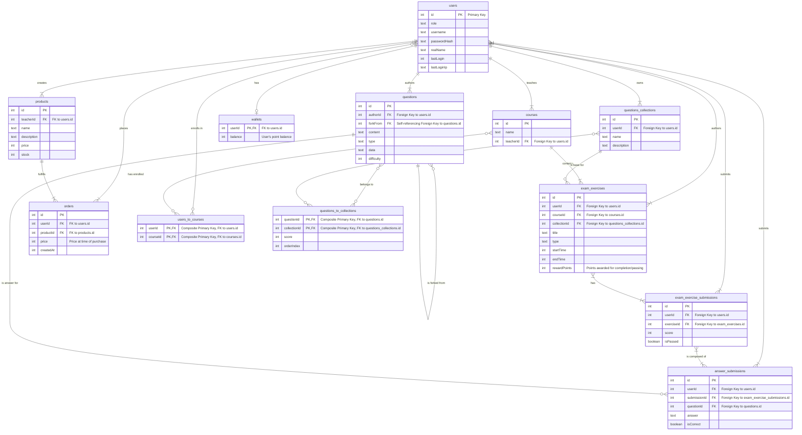

# Yet Another Easy Examining Tool (YAEET)
> 一个简单的考试工具

## 特性

- 支持多种题型：选择题、填空题、问答题等（具体看数据模型）
- 支持多门学科：信息技术、数学、英语等
- 富文本格式支持
- 全自动ai评分功能
- 高效的题库管理、导入导出、分享
- 丰富的后台管理与统计分析
- 商城功能
- 额外的插件支持

## 技术栈

- 前端：React、bun、Tailwind CSS、TypeScript、Vite、Shadcn UI
- 后端：bun、Elysia
- 数据库：SQLite

## 原理

使用bun编译将最终的代码打包成单一的可执行文件，设计一套插件规范，允许动态导入插件，开发者需要使用 Bun（或其他打包工具）将他们的插件及其所有依赖项打包成一个独立的、不含外部 import 的 JavaScript 文件。

## 计划

- [x] 完成数据库设计
- [ ] 实现用户注册功能
- [ ] 实现用户登录功能
- [ ] 实现考试创建功能
- [ ] 实现考试管理功能
- [ ] 实现成绩统计功能

## 数据模型

# 外包招募

由于作者本人时间有限，现招募外包开发者协助完成项目，具体需求如下：

1. 熟悉前端技术栈（React、Tailwind CSS、TypeScript等）
2. 能够快速上手后端技术栈（bun、Elysia等），允许vibe coding（Elysia.js甚至提供了[llm.txt](https://elysiajs.com/llms-full.txt)）
3. 有探索精神，愿意尝试新技术、新工具（Elysia.js是一个比较新的框架，存在bug）
4. 与作者保持良好沟通，及时反馈进展与问题，任何大型更新都需要提前沟通（比如新增数据库表）
5. 预算¥2000，无deadline，提供300刀额度的gemini 2.5 pro免费使用

有意者请联系作者，微信号：wutayi

## 贡献与版权
所有参与本项目的开发者（包括外包开发者）在提交代码前，需要签署一份贡献者许可协议（Contributor License Agreement, CLA）。签署此协议意味着您同意将您贡献内容（包括代码、文档等）的版权转让给项目所有者（即本人）。

## 详细需求说明
这个项目主要用于高中信息技术机房内使用。教师通过运行exe程序即可启动系统，在局域网内均可访问。

系统内有三类账号，分别是学生、教师和管理员。

### 管理员 (Admin)
管理员拥有系统的最高权限，负责系统的基本维护和用户管理。
- **用户管理**:
    - 创建、编辑、删除所有角色（管理员、教师、学生）的账户。
    - 可以批量导入用户列表。
    - 查看系统内所有用户的基本信息和登录记录。
- **课程管理**:
    - 创建、编辑、删除课程。
    - 为课程分配授课教师。
- **系统配置**:
    - 控制用户是否可以自由注册。
    - (未来) 配置系统基本信息、插件管理等。

### 教师 (Teacher)
教师是系统的核心使用者，负责教学内容的创建、发布和评估。
- **课程管理**:
    - 创建、编辑、删除自己教授的课程。
    - 管理自己课程下的学生名单，包括添加和移除学生。
- **题库管理**:
    - 创建、编辑、删除题目。题目类型支持：
        - 单选题
        - 多选题
        - 判断题
        - 填空题
        - 问答题
        - 程序题 (支持 Python, JavaScript)
    - 为题目添加内容、答案、解析、难度系数和标签。
    - 支持从现有题目“Fork”一份进行修改，创建新题。
    - 可以将题目组合成“题集”，方便后续组卷。
- **考试/练习管理**:
    - 基于“题集”创建考试或练习。
    - 设置考试/练习的标题、描述、所属课程、起止时间、考试时长、重试次数、及格分数等。
    - 可设置题目顺序固定或随机。
    - 可设置选择题选项顺序固定或随机。
- **批改与统计**:
    - 查看学生提交的答卷列表。
    - 系统自动批改客观题（选择、判断、填空、程序题）。
    - 主观题（问答题）也支持AI自动批改，教师可对AI批改结果进行复核和调整。
    - 查看全班的成绩统计，如平均分、最高分、及格率等。
    - 查看单个题目的作答情况统计，如正确率。

### 学生 (Student)
学生是系统的主要参与者，通过系统完成学习和考核任务。
- **课程学习**:
    - 查看自己已加入的课程列表。
    - 参与课程内的考试和练习。
- **在线考试**:
    - 在指定时间内参加考试或练习。
    - 在线作答，提交答案。
    - 考试结束后，立即查看客观题部分的得分（如果教师设置允许）。
- **成绩查看**:
    - 查看自己所有考试/练习的历史记录和得分。
    - 查看已批改试卷的详细情况，包括每道题的答案和解析。
- **个人题集**:
    - 可以创建自己的“题集”，收藏题目用于复习。

### 商城与奖励 (Store & Rewards)
为了增加学习的趣味性，系统引入了商城和奖励机制。
- **教师**:
    - 可以为自己创建的考试/练习设置奖励积分，学生达到特定条件（如及格、获得高分）后可自动获得。
    - 可以在商城中发布虚拟商品（如“免作业卡”、“补考机会”等），并设置价格和库存。
- **学生**:
    - 通过完成学习任务获得积分，积分存入个人钱包。
    - 可以在商城中使用积分兑换教师发布的商品。
